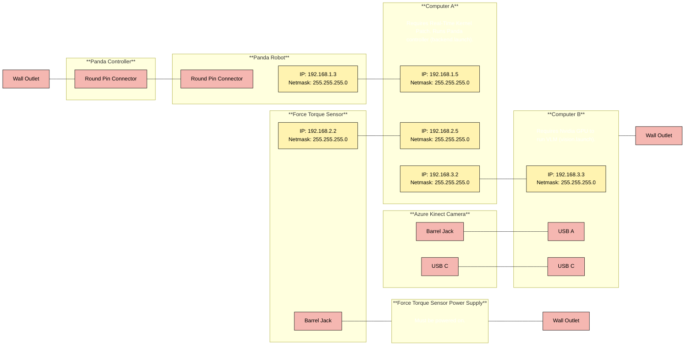
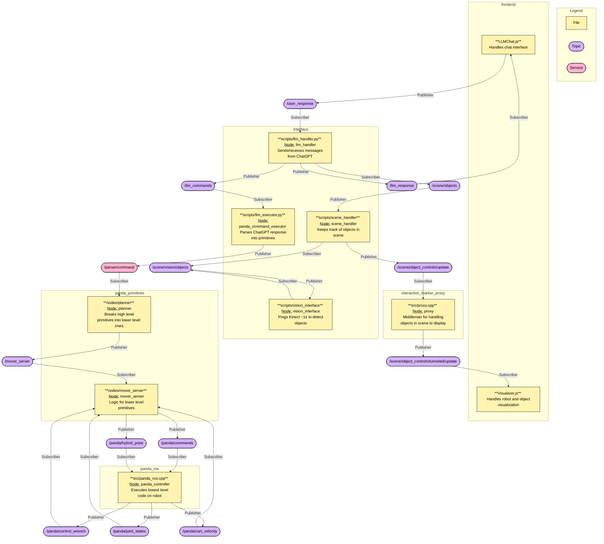

# Dexterity Interface

## Setup
### 1. Install Requirements

* For the simulation/interface you will need:
    * Ubuntu Machine A with the [Realtime Kernel Patch Kernel Patch](https://frankaemika.github.io/docs/installation_linux.html#setting-up-the-real-time-kernel)
    * [Docker Engine](https://docs.docker.com/engine/install/).
    * A live server. For VScode, we recommend [Live Server Extension](https://marketplace.visualstudio.com/items?itemName=ritwickdey.LiveServer).

* For Running on the Panda you will additionally need:
    * Above requirements.
    * Franka Emika Panda 7 DOF Robot setup with the [FCI](https://frankaemika.github.io/docs/getting_started.html).
        * Robot system version: 4.2.X (FER pandas)
        * Robot / Gripper Server version: 5 / 3
    * [Axio80-M20 Force Torque Sensor](https://www.ati-ia.com/products/ft/ft_models.aspx?id=Axia80-M20) installed on the Panda's End Effector.

* For Running with the Vision and Kinect you will additionally need:
    * Ubuntu Machine B with Nvidia GPU
    * Azure Kinect


<br>

Below is a diagram for the proper static IPs and wiring that you need to setup the full system:



### 2. Setup LLM configs
1. First, you need to create a .env file in this folder with the OpenAI credentials. It should be in this format:
    ```bash
    OPENAI_API=YOUR_API_KEY_HERE
    ```

### 3. Set up the repository and run the container
1. Bring in the submodules and/or make sure they are updated:
    ```bash
    git submodule update --init --recursive
    ```

3. Now  build the container image and start the container. Make sure you are in this root directory. These commands mount on the current directory as the containers file system so any changes you make to the files on your host machine will be mirrored in the container. These commands also allow the containers display to be forwarded to your host machine so that you can see it.

    ```bash
    sudo docker build -t dex-interface .
    ```

    If you don't need the Kinect, run:
    ```bash
    sudo docker run --rm -it --privileged --cap-add=SYS_NICE --device=/dev/input/event* --env DISPLAY=$DISPLAY -v /tmp/.X11-unix:/tmp/.X11-unix -v $(pwd):/workspace --net=host dex-interface
    ```

    Else if you do need the Kinect, run:
    ```bash
    xhost +local:

    sudo docker run -it --rm --gpus all --privileged -e DISPLAY=$DISPLAY -e PULSE_SERVER=unix:/run/user/1000/pulse/native -v /run/user/1000/pulse:/run/user/1000/pulse -v /tmp/.X11-unix:/tmp/.X11-unix -v $(pwd):/workspace --device /dev/snd --device /dev/bus/usb --net=host dex-interface  
    ```

### 3.5 Compile panda-primitives-control package (SKIP FOR JUST SIMULATION/INTERFACE)
This step will compile panda-primitives-control package that control Panda Robot in low level, you can skip it if you only need simulation

1. Add necessary environment variables: Replace with your Panda's IP
    ```bash
    export PANDA_IP=192.168.1.3
    ```
2. ### Compile non-ROS package (PandaController)

    ```bash
    cd backend-ros/src/PandaController/
    mkdir -p build
    cd build
    [ -f Makefile ] || cmake ..  # Only initialize if not  already
    make install
    cd ../../../..
    ```

3. Setup panda 
Use Franka Desktop to unlock the Panda's joints and enable FCI mode.
For more information, please refer to [PandController](https://github.com/Wisc-HCI/PandaController.git)


### 4. Compile ros packages

```bash
cd backend-ros
catkin build
source devel/setup.bash
```

## Running
1. Launch the Backend. Make sure you are in the `backend-ros/` directory when running these commands, each in a different terminal.

    1. If you want the program to run on the robot run these each: 
		```bash
        roslaunch interface backend.launch only_virtual:=false
		```

        Else if you just want to run in simulation,  run:
     	```bash
        roslaunch interface backend.launch only_virtual:=true 
		```


    2. If you are using the kinect run the following. Make sure this is on the computer with the Nvidia GPU.
        ```bash
        roslaunch interface vision.launch use_kinect:=true
        ```
        
        Else, to simulate a couple objects from the camera, use:
        ```bash
        roslaunch interface vision.launch use_kinect:=false
        ```


2. Launch a live server for `frontend/index.html`. If you are using VScode, you can do that by selecting that file to open it, and in the lower right of VSCode click "Go Live". This should launch the interface in your browser.


## Running across multiple computers

On both computers, run:
```bash
export ROS_MASTER_URI=http://<IP_ADDRESS_OF_MAIN_MACHINE>:11311
export ROS_IP=<IP_ADDRESS_OF_CURRENT_MACHINE>
```

For example in our setup, our "main" computer (with roscore) would be the laptop and 
we would run the following there:
```bash
export ROS_MASTER_URI=http://192.168.3.2:11311
export ROS_IP=192.168.3.2
```

And run the following on the secondary desktop computer:
```bash
export ROS_MASTER_URI=http://192.168.3.2:11311
export ROS_IP=192.168.3.3
```

Note, if you open more terminals on each machine, you will have to run these exports in each new terminal.

On the "main" computer, run the following:
```bash
roscore
```

Now you are ready to run all the previous commands across your 2 machines.


## Launching multiple docker terminals
To open multiple another terminal to you docker container, first run `sudo docker ps` on your local machine. This will give you a list of containers with container IDs. Then run `sudo docker exec -it YOUR_CONTAINER_ID bash` with your container ID. 


## Troubleshooting

```bash
# To view submodule status
git submodule status


# To view TF frames
rosrun tf2_tools view_frames.py
```

## Submodules

These are the submodules used in this project
- [authoring_msgs](https://github.com/emmanuel-senft/authoring-msgs)
- [interactive_marker_proxy_noetic](https://github.com/schromya/interactive_marker_proxy_noetic/tree/tf-lifetime-fix): Make sure you are on the tf-lifetime-fix branch
- [panda_ros](https://github.com/Wisc-HCI/panda_ros)
- [panda-primitives](https://github.com/Wisc-HCI/panda-primitives/tree/interface): Make sure you are on the interface branch
- [panda-ros-msgs](https://github.com/emmanuel-senft/panda-ros-msgs/tree/study): Make sure you are on the study branch
- [PandController](https://github.com/Wisc-HCI/PandaController)
- [ros_numpy](https://github.com/eric-wieser/ros_numpy)
- [rviz_camera_stream](https://github.com/lucasw/rviz_camera_stream)
- [assistive_robotics_thesis](https://github.com/rusmilov/assistive_robotics_thesis/tree/hand-integration): Make sure you are on the hand-integration branch
- 


## ROS Packages and Topics



## Resources
* https://robotwebtools.github.io/
* https://github.com/Mechazo11/interactive_marker_proxy_noetic
* https://github.com/ros-visualization/visualization_tutorials/tree/noetic-devel/interactive_marker_tutorials
* http://wiki.ros.org/roslibjs/Tutorials/BasicRosFunctionality
* https://robotwebtools.github.io/ros3djs/
* https://docs.ros.org/en/noetic/api/visualization_msgs/html/msg/InteractiveMarkerControl.html


